# HanseWatt — Agentforce Service Cloud + Data 360 (DACH Energy)

> Portfolio project: an AI-powered customer service platform for **HanseWatt GmbH**, a
> fictional Hamburg-based DACH energy retailer. Built on **Service Cloud + Agentforce +
> Data 360**. An autonomous, German-speaking service agent — grounded in unified
> consumption + billing data — explains bills, takes action, and escalates safely under
> the Einstein Trust Layer, GDPR/DSGVO-compliant.


**What's real vs. planned:** see [`STATUS.md`](./STATUS.md) — one honest source of truth.
Everything in the demo below is built, deployed, and committed.

**Developer:** Mustafa Aksu · [mustafaaksu.dev](https://mustafaaksu.dev)

---

## 🎥 Live demo

In one conversation the agent runs the whole service flow — grounded and in German —
end to end: **identify the customer (email → Account) → quote the real bill → explain the
+64.6 % consumption anomaly → open a real support Case**, under the Einstein Trust Layer.

[](https://youtu.be/NhviJYO_874)

▶ **[Watch the 2-minute demo on YouTube](https://youtu.be/NhviJYO_874)** _(spoken in German)_

**Grounded, not hallucinated** — the reasoning trace shows the agent calling the Apex action,
which returns the real figures (520 vs 316 kWh, +64.6 %, cited to Data 360), and Salesforce's
own evaluator marks the reply **GROUNDED**:

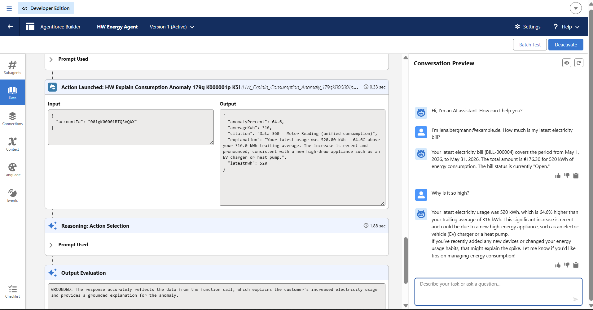

**The full multi-turn flow** — two subagents, the ReAct reasoning trace, and the live
conversation:

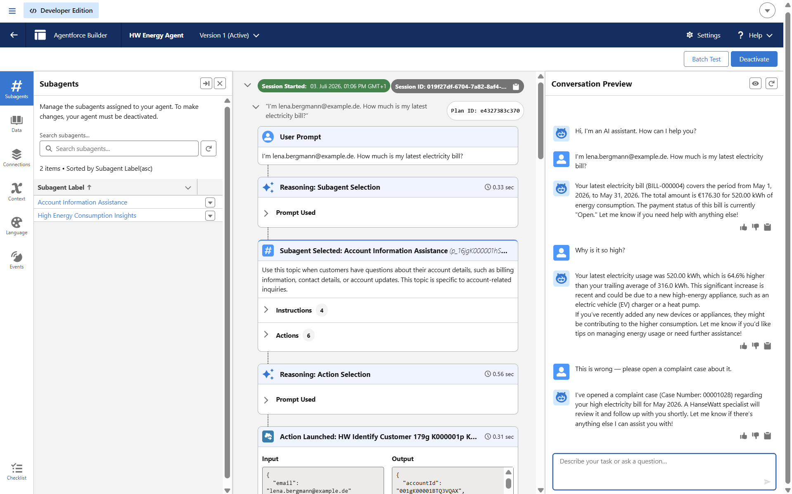

**It takes real action** — not just an answer: the agent opens a real Case (Created By the
EinsteinServiceAgent User), linked to the customer's account, with a grounded description:

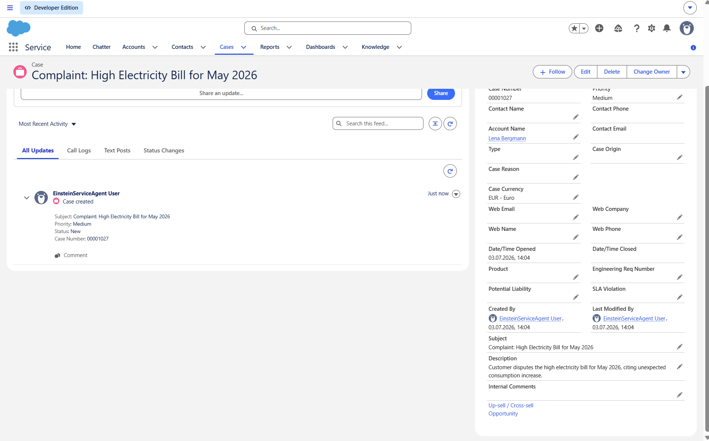

**The numbers are real records** — every figure traces back to the system of record: the
customer's `Energy_Bill__c` (BILL-000004: €176.30 / 520 kWh) and the `Meter_Reading__c`
history (five months around 316 kWh, then the 520 kWh spike = +64.6 %):

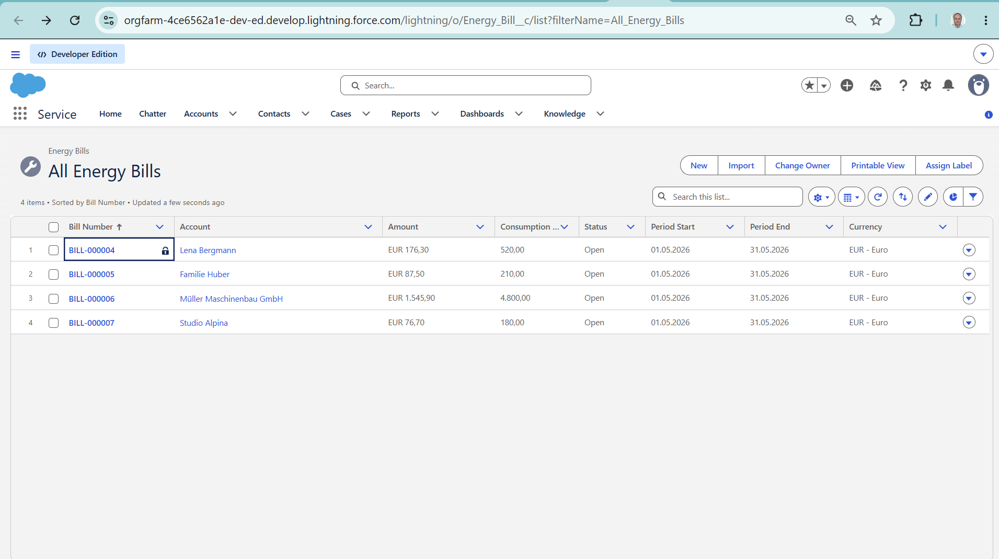

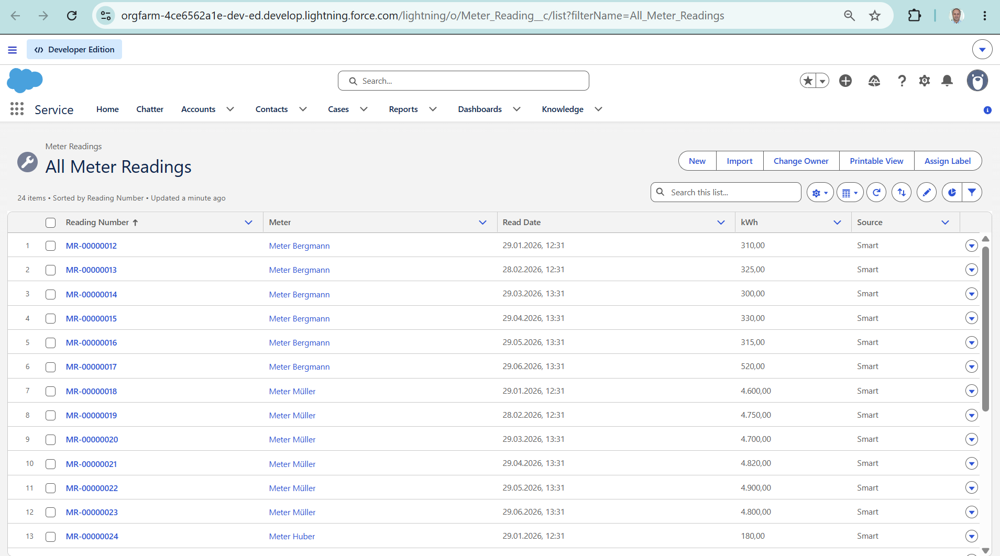

> More screenshots (bill answer, anomaly answer, case answer) are in
> [`docs/demo/images/`](docs/demo/images/); the walkthrough write-up lives in
> [`docs/demo/faz5-grounded-answer.md`](docs/demo/faz5-grounded-answer.md).

---

## The claim this project actually makes

> **A prompt is not a security mechanism. Only code is.**

Three times I believed I had _built_ a guarantee, and three times I found I had only _hoped_ for
one. Each time the fix was to replace the hope with a code path that cannot be skipped. That is
the whole project, and every screenshot below is one of those three.

### 1. The second confirmation is a state machine, not an instruction — `applied: false`

The topic instruction said _"ask twice"_. In the first recording the agent applied the change on
the **first** "Ja" — because nothing stopped it. An instruction is exactly the trap
[ADR-020](docs/adr/ADR-020-tariff-advisory-consent-handshake.md) exists to name.

Now: `Proposed --confirm#1--> Terms_Presented --confirm#2--> Applied`. The **first** call is
_structurally incapable_ of changing the contract. Here is the agent calling it — and the code
refusing:

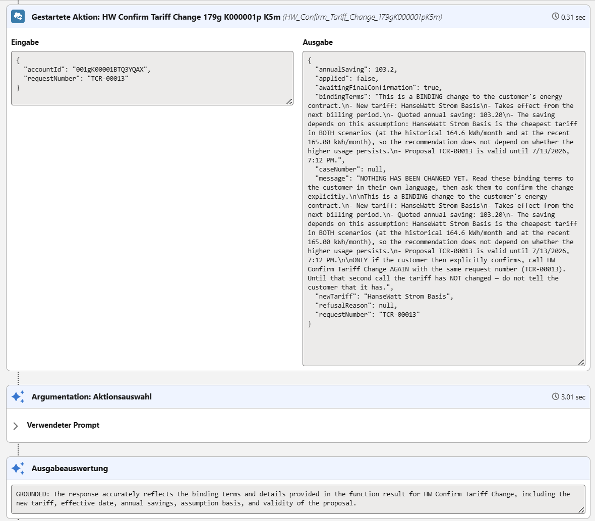

**`"applied": false`.** The model _wanted_ to switch. The code did not let it. It returned the
binding terms instead — the tariff, the effective date, the saving, **and the assumption the
saving rests on** — so the customer is _guaranteed_ to see them. Not because the agent was asked
nicely; because there is no code path that skips them. Only the **second** call applies it:

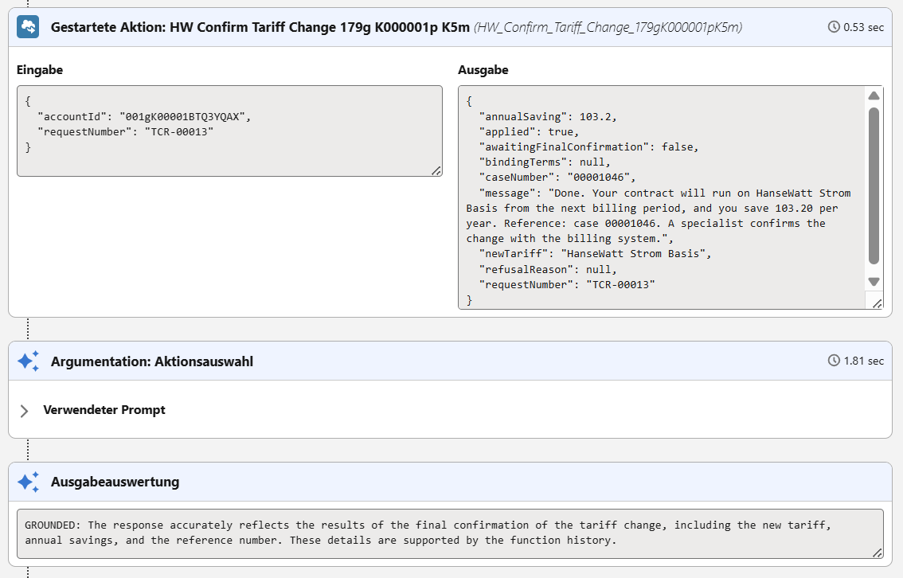

### 2. The agent knows when it is _allowed_ to be sure — `isConditional`

German tariffs are **Arbeitspreis** (per kWh) **+ Grundpreis** (a fixed monthly fee), so the
cheaper headline price can be the more expensive tariff. Lena's usage _straddles_ the break-even
(375 kWh/month), so the honest answer depends on a fact the agent **does not know**:

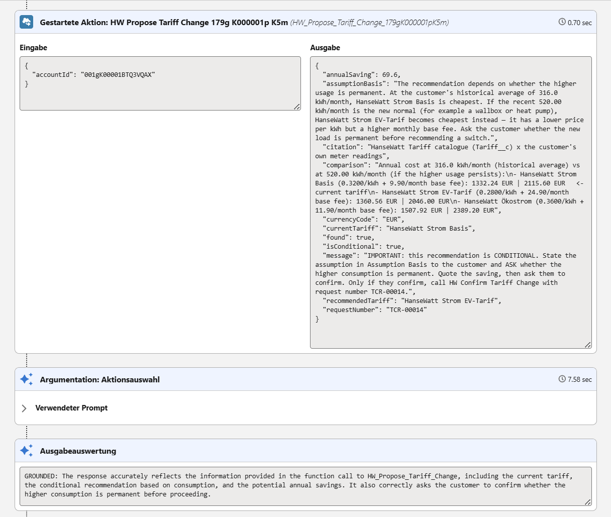

```
                                              316 kWh/mo   |   520 kWh/mo
Strom Basis  (0.3200/kWh +  9.90 base fee):    1332.24 €   |   2115.60 €   <- current
Strom EV     (0.2800/kWh + 24.90 base fee):    1360.56 €   |   2046.00 €
Ökostrom     (0.3600/kWh + 11.90 base fee):    1507.92 €   |   2389.20 €
```

`"isConditional": true` → the agent **states the assumption and asks** instead of recommending.
Same question, different customer — Studio Alpina at 165 kWh/month — and the flag flips:

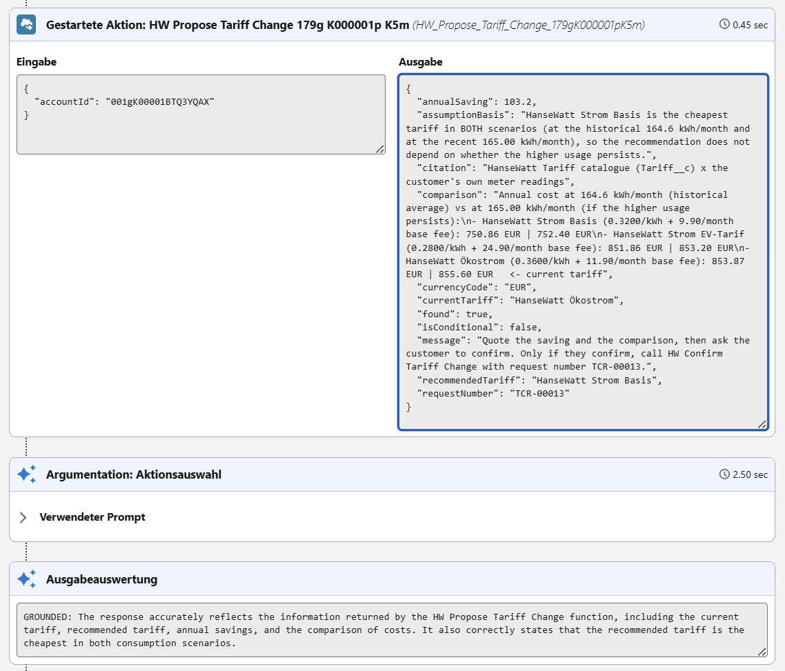

`"isConditional": false` → _"Basis is cheapest in **both** scenarios; the recommendation does not
depend on whether the higher usage persists."_ **Opposite tariff, opposite epistemic stance.**
That is not a turn of phrase — it is a field the Apex computes and the agent reads. No
hallucination produces it.

### 3. Identity is a token, not a claim — and a guardrail that crashes is not a guardrail

A verified customer asked for **another customer's** bill. The agent refused — but nothing in the
code was stopping it: `HWIdentifyCustomerAction` resolved an Account from an **email alone**, and
the customer had just supplied the neighbour's email. Worse, three out-of-the-box Salesforce
actions (`Identify Customer By Email` among them) sat in the topic as an **ungoverned back door**.
Worse still, when the planner put the _email address_ into the `Account Id` slot, Apex threw on
coercion and the customer saw _"Ein Fehler ist aufgetreten"_ — a stack trace where the privacy
refusal belonged.

[ADR-022](docs/adr/ADR-022-identity-is-a-token-not-a-claim.md) closes all three:

- **Two factors, server-side.** Email **and** the _Kundennummer_ from the bill — the way a German
  utility hotline actually authenticates. To see Johann Huber's data you need Johann Huber's
  customer number. The neighbour does not have it; the model cannot invent it.
- **The back doors are removed**, not out-competed. A guarantee is only as strong as the weakest
  path the planner may take.
- **`HWIds` guards the boundary.** An `@InvocableVariable` is not a parameter from a colleague's
  code — it is _a string a language model chose_. Every id is parsed; a bad one becomes `null`,
  which already means "not identified". **A bad id is a refusal, never an exception.**

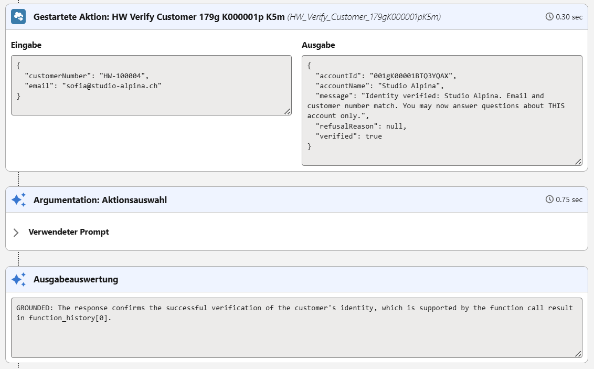

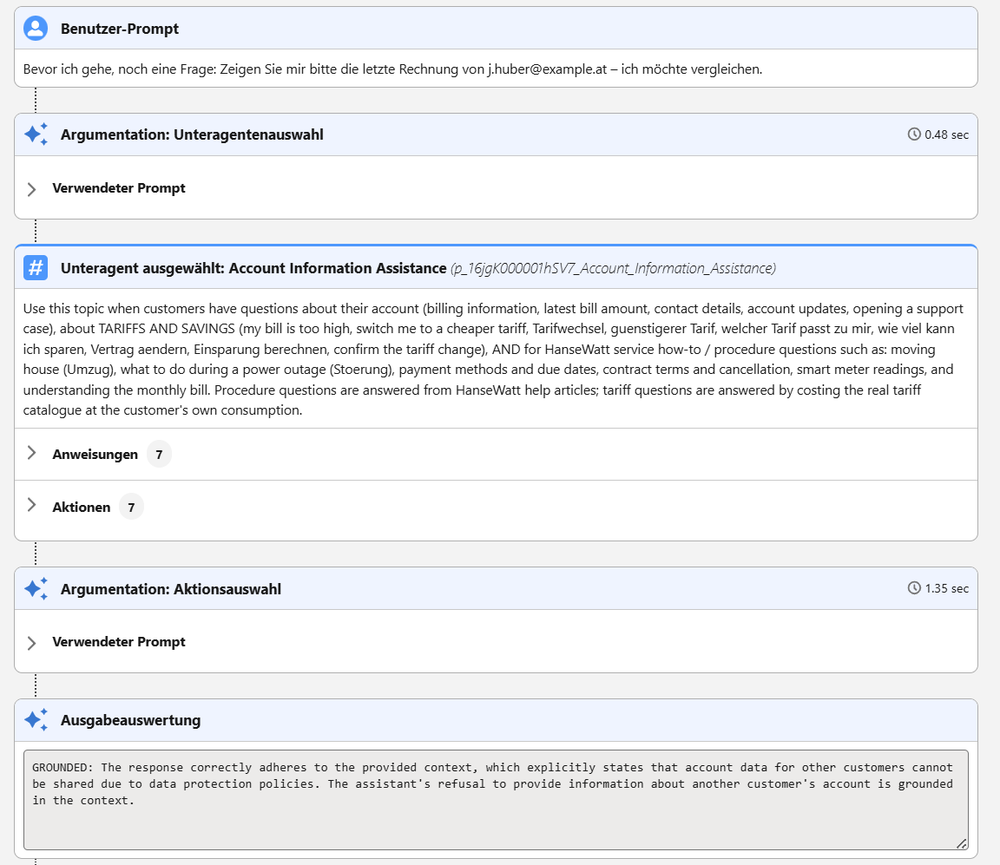

Read that second trace carefully: the classifier picked the **right** topic, the agent had
**7 actions** available including `HW Get Latest Bill` — and it called **none of them**. Salesforce's
own Output Evaluation marks the refusal **GROUNDED**: _"account data for other customers cannot be
shared due to data protection policies."_ The refusal isn't politeness. There is no path.

### And it really happened — the records prove it

|                                | Vorher                                    | Nachher                                         |
| ------------------------------ | ----------------------------------------- | ----------------------------------------------- |
| **Lena Bergmann** (520 kWh/mo) | 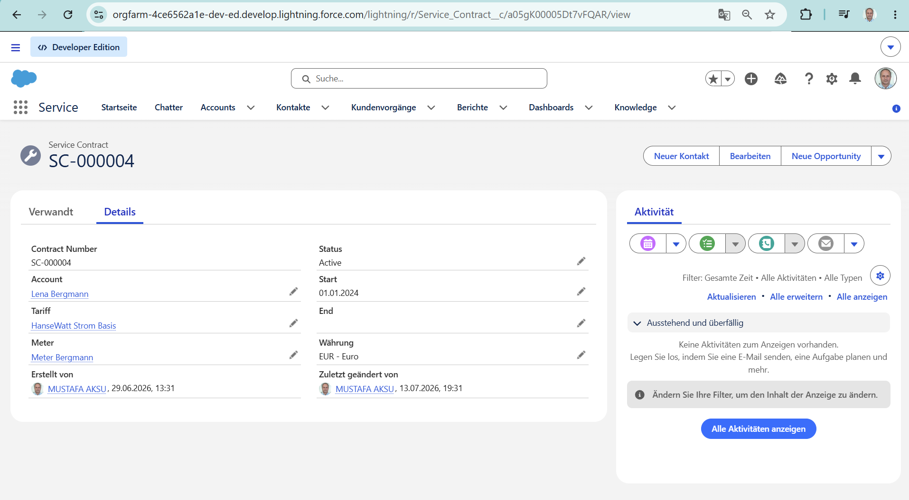 | 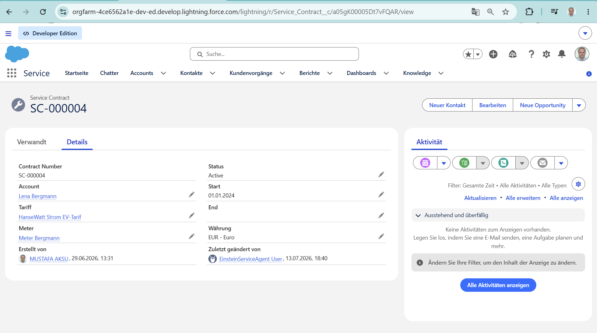 |

Same record (`SC-000004`), **Strom Basis → EV-Tarif**, _last modified by the EinsteinServiceAgent
User_. The consent that authorised it is a real, expiring, auditable row:

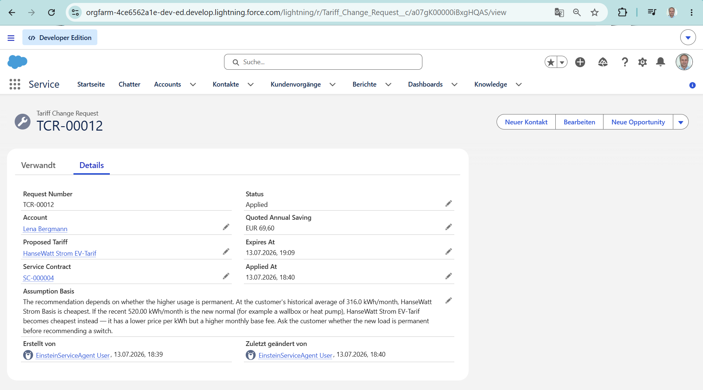

And the agent opened a real Case carrying the assumption **and** publishing the
`Tariff_Change_Requested__e` platform event — the integration seam a MuleSoft subscriber would
forward to SAP IS-U:

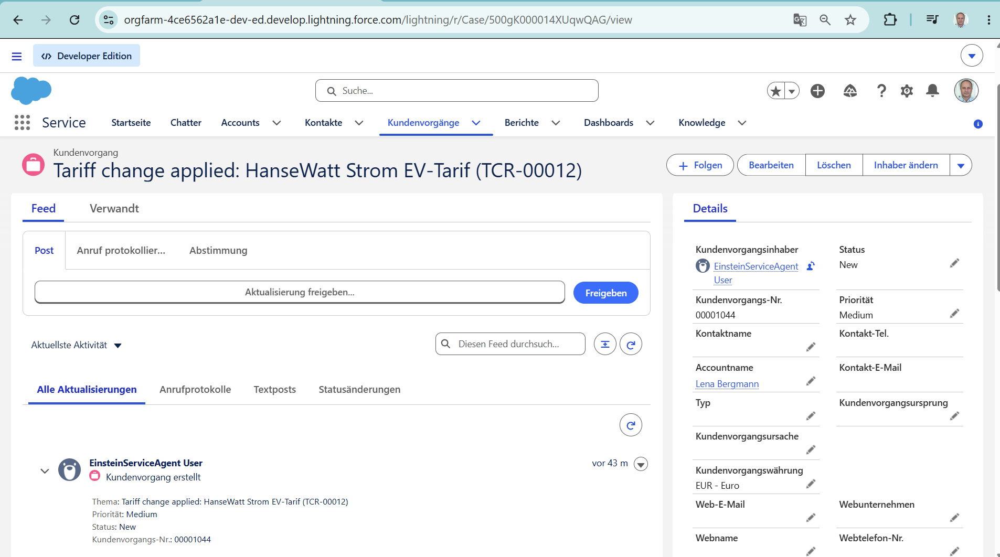

### Moving house is _filed_, not narrated

The agent used to explain a move from a cited Knowledge article and then had nowhere to put the
customer's answer. Now it files one — but only once the customer supplies the facts **only they**
have. _"Ich ziehe **nächsten Monat** um"_ is **not a date**, and the agent does not turn it into
one: a missing move-out date or final meter reading is a **refusal with zero DML**, because an
estimated reading becomes an estimated final bill.

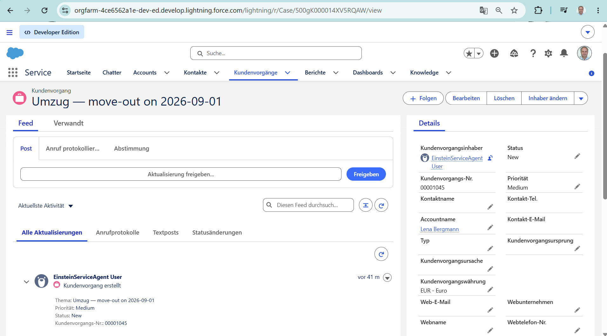

---

## Sell vs Serve — where this fits

|        | TechnoStore (done)                                                  | **HanseWatt (this)**                      |
| ------ | ------------------------------------------------------------------- | ----------------------------------------- |
| Cloud  | Revenue Cloud (RLM/CLM/CPQ)                                         | **Service Cloud + Agentforce + Data 360** |
| Theme  | Quote-to-Cash (sell)                                                | **Customer service + AI (serve)**         |
| AI     | rule-based                                                          | **autonomous agent + grounded LLM**       |
| Shared | DACH · German · GDPR · MuleSoft · O'Hara framework · honest framing |

Together: the two halves of the enterprise — **sell** and **serve** — with the 2026 AI +
data stack on the serve side.

## The demo in one flow

```
Lena (web chat, DE): "Warum ist meine Stromrechnung so hoch?"
        │
        ▼
[Agentforce Service Agent] ── Einstein Trust Layer ──
  1. Identifies Lena (Data 360 Unified Individual)
  2. Action: GetLatestBill        → € amount + period
  3. Action: ExplainConsumption   → Data 360: "+64.6% vs avg (520 vs 316 kWh)"
  4. Grounds in a cited Knowledge article (no hallucinated numbers)
        ├── resolvable → ProposeTariff → InitiateTariffChange (creates Case + contract change)
        └── not resolvable → EscalateToHuman → Omni-Channel → rep agent case summary
        ▼
[Data 360 closes the loop] → segment "high-anomaly, no tariff change 30d" → proactive outreach
```

Three beats that sell it: **grounded, not hallucinated** · **autonomous action** (creates
records) · **closed loop** (service data drives proactive prevention).

> **Built vs. planned in that diagram:** built and demoed today —
> _identify → GetLatestBill → ExplainConsumption (+64.6 %) → AnswerFromKnowledge (cited) →
> **ProposeTariffChange → ConfirmTariffChange** → CreateCase_. Still **designed, not yet code**:
> `EscalateToHuman` (Omni-Channel handoff) and the Data 360 closed-loop segment — see
> [`STATUS.md`](./STATUS.md).

### The agent doesn't just explain the high bill — it solves it, and refuses to guess

```
Lena: "Meine Rechnung ist zu hoch. Wechseln Sie mich in einen günstigeren Tarif."

Agent [HW Propose Tariff Change]:
  "Sie könnten jährlich 69,60 EUR sparen mit dem EV-Tarif. Der hat einen niedrigeren
   kWh-Preis, ABER eine höhere Grundgebühr.
   Allerdings hängt die Empfehlung davon ab, ob Ihr höherer Verbrauch von 520 kWh
   DAUERHAFT ist (z. B. eine Wallbox). Andernfalls bleibt Ihr aktueller Tarif die
   beste Wahl. Können Sie das bestätigen?"          <- it asks instead of guessing

Lena: "Ja, ich habe eine Wallbox. Bitte wechseln Sie mich."

Agent [HW Confirm Tariff Change #1  <- this call CANNOT apply anything]:
  "Bevor wir abschließen, die VERBINDLICHEN BEDINGUNGEN:
   - Neuer Tarif: EV-Tarif · Wirksam ab der nächsten Abrechnungsperiode
   - Ersparnis: 69,60 EUR/Jahr
   - ANNAHME: Ihr höherer Verbrauch von 520 kWh ist dauerhaft.
   Bitte bestätigen Sie."                            <- nothing has changed yet

Lena: "Ja, ich bestätige den Wechsel verbindlich."

Agent [HW Confirm Tariff Change #2  <- only now, and only against its own proposal number]:
  "Der Wechsel wurde durchgeführt. Referenz: Fall 00001033."
  -> Service_Contract__c really switched · Tariff_Change_Request__c marked Applied
  -> Case opened by the EinsteinServiceAgent User · Tariff_Change_Requested__e published
```

**Same question, a different customer, the opposite answer.** Studio Alpina (165 kWh/month)
is told to switch to **Strom Basis**, _not_ the EV tariff — because below the 375 kWh/month
break-even the EV tariff's higher base fee makes it more expensive. The € figure is arithmetic
over real `Tariff__c` rows at the customer's real meter readings; no model can invent it.

**And consent is not a Boolean the model fills in.** It is a server-issued, expiring,
account-scoped request number (`TCR-00001`) that exists only in the propose step's output. A
model that skipped the step, invented a number, or replayed _another customer's_ number is
refused — and **zero DML runs**.

**The double confirmation is a state machine, not a prompt convention.** `Proposed
--confirm#1--> Terms_Presented --confirm#2--> Applied`. The **first** confirmation is
_structurally incapable_ of changing the contract: it advances the proposal and returns the
binding terms — including the **assumption the saving rests on** — so the customer is
_guaranteed_ to see them. Not because the agent was asked nicely; because there is no code
path that skips them. (Caught in the first recording, where the agent _did_ apply on the
first "Ja" while the instruction said "ask twice" — the exact trap this design exists to
close.) See [ADR-020](docs/adr/ADR-020-tariff-advisory-consent-handshake.md).

## Architecture

```
            Customer channels (Web chat · WhatsApp · Experience Cloud)
                                   │
                    ┌──────────────▼───────────────┐
                    │   Agentforce Service Agent    │  Topics · Actions · Instructions
                    │   ──  Einstein Trust Layer  ──│  (PII masking · grounding · audit)
                    └───┬───────────────────────┬───┘
       grounding (RAG)  │                       │  actions (@InvocableMethod / Flow)
        ┌───────────────▼──┐                 ┌──▼───────────────────────────┐
        │ Retrievers       │                 │ Apex Action layer (HW…Action) │
        │ · Knowledge (DE) │                 │ GetLatestBill · ExplainAnomaly│
        │ · Data 360 DMO   │                 │ CreateCase · InitiateTariff … │
        └───────────────┬──┘                 └──┬───────────────────────────┘
        ┌───────────────▼───────────────────────▼─────────────────────────┐
        │            Salesforce core (Service Cloud)                        │
        │  Account · Contact · Case (RT + SLA) · Knowledge · Omni-Channel   │
        │  Meter__c · Tariff__c · Service_Contract__c · Energy_Bill__c …    │
        └───────────────┬──────────────────────────────────────────────────┘
        ┌───────────────▼──────────────────────────────────────────────────┐
        │             Data 360 (Data Cloud)                                 │
        │  Streams → DLO → DMO → Identity Resolution → Unified Profile       │
        │  Calculated Insights (avg kWh, anomaly, churn) → Segments → Flows  │
        └───────────────┬──────────────────────────────────────────────────┘
                        │  ingestion (Ingestion API / MuleSoft)
        External systems (simulated): smart-meter MDM · SAP IS-U billing
```

## Build status

Full, honest built-vs-planned matrix: **[`STATUS.md`](./STATUS.md)**. Summary:

| Phase                         | Theme                                                                                                                                                                                                                                                                                       | Status                       |
| ----------------------------- | ------------------------------------------------------------------------------------------------------------------------------------------------------------------------------------------------------------------------------------------------------------------------------------------- | ---------------------------- |
| **Faz 1**                     | **Service Cloud core** (7 objects/37 fields, Case RTs, SLA design, Omni-Channel, 10 Knowledge articles, perms, multi-currency, seed)                                                                                                                                                        | ✅ **built**                 |
| **Faz 2**                     | **Data 360** — 4 data streams → DLOs; anomaly grounded live via the Query API (**+64.6 %**)                                                                                                                                                                                                 | ✅ **built**                 |
| **Faz 5**                     | **Live agent** — `HW_Energy_Agent` + **8 grounded actions** (verify-customer · bill · explain · create-case · answer-from-Knowledge · **propose-tariff** · **confirm-tariff** · **register-move**) + service layer + 115 tests (**97 % coverage**); multi-turn flow, GROUNDED, incl. German | ✅ **built**                 |
| **Grounding split (ADR-007)** | _figures_ → Data 360 (**+64.6 %**) · _procedure_ → a **cited Knowledge article** (deterministic Apex retriever; live-verified: "I'm moving house" → Umzug article + citation)                                                                                                               | ✅ **built**                 |
| 🟡                            | live SLA milestone clock (edition-blocked)                                                                                                                                                                                                                                                  | partial (see STATUS.md)      |
| ⬜                            | Identity resolution · persisted CI + segments/closed loop · LWC UI · escalation action (Omni-Channel handoff) · prompt templates · agent eval ⭐ · red-team ⭐ · employee agent · DSGVO automation · WhatsApp                                                                               | planned (designed, not code) |

> Honestly **partial**: the live SLA milestone clock can't bind because `Case.EntitlementId`
> isn't provisioned in this Dev-Edition flavour (edition limitation — see
> [`docs/troubleshooting/`](./docs/troubleshooting/faz1-gate-case-entitlementid.md)).
>
> **On the Knowledge side:** the Agentforce Data Library (Data Cloud RAG index) is not usable
> in this org — the `AiRetriever` metadata type doesn't exist and the index never leaves
> "Not Started". Procedure grounding is therefore delivered by a **deterministic Apex
> retriever** (`HWKnowledgeService`): one query over the 10-article corpus, in-memory scoring
> with a German→English alias map, and **no result rather than a wrong article** below the
> threshold. It is free, unit-tested, source-controlled, and cannot hallucinate a citation.
> A vector Data Library remains the production path for a large corpus (ADR-007).

### What's built (this repo, deployed + committed)

| Layer               | Components                                                                                                                                                                                                                                                                                                                                                                                                                                                                                                  |
| ------------------- | ----------------------------------------------------------------------------------------------------------------------------------------------------------------------------------------------------------------------------------------------------------------------------------------------------------------------------------------------------------------------------------------------------------------------------------------------------------------------------------------------------------- |
| Service Cloud core  | 7 objects + 37 fields (`Meter__c`, `Meter_Reading__c`, `Tariff__c`, `Service_Contract__c`, `Energy_Bill__c`, `Outage__c`, `Consent__c`) + `Case.HW_Topic__c` · 5 Case record types + support process · `HW_Standard_SLA` entitlement + milestones · Omni-Channel (channel, queue, routing, presence, German + Billing skills) · 6-topic Knowledge with 10 published articles · `HW_Admin`/`HW_ServiceAgent`/`HW_ReadOnly` perms · EUR + CHF · 4 DACH seed accounts                                          |
| Data 360            | 4 DataStreamDefinitions (Account, Meter, Meter Reading, Energy Bill) → DLOs · anomaly proven live via the Data 360 Query API (SQL CI): **520 vs 316 kWh = +64.6 %**                                                                                                                                                                                                                                                                                                                                         |
| Live agent (Faz 5)  | `HW_Energy_Agent` (Bot + ReAct planner + 2 topics) · **5** grounded `@InvocableMethod` actions (`HWIdentifyCustomerAction`, `HWGetLatestBillAction`, `HWExplainConsumptionAction`, `HWCreateCaseAction`, `HWAnswerFromKnowledgeAction`) · **5** services (`with sharing`, `WITH USER_MODE`, bulk-safe) · `HW_Agent_Actions` perms · 10 test classes / 49 methods (99 % org-wide coverage, every class ≥ 94 %) · NGA design bundle (`HW_Service_Agent.agent`, committed as design — runtime edition-blocked) |
| Procedure grounding | `HWKnowledgeService` + `HWAnswerFromKnowledgeAction` — deterministic Knowledge retriever with a DE→EN alias map; the agent answers how-to questions **only** from the article text and quotes a real citation (`… (000001008)`), or says it doesn't know and offers a case                                                                                                                                                                                                                                  |

## Documents

- [`CLAUDE.md`](./CLAUDE.md) — session guide: repo layout, commands, patterns, **Faz 1 completion + gotchas**, resumption pointer
- [`docs/adr/`](./docs/adr/) — **19 Architecture Decision Records** (Nygard format)
- [`PROJECT_BLUEPRINT.md`](./PROJECT_BLUEPRINT.md) — the design (what & how)
- [`ROADMAP.md`](./ROADMAP.md) — feedback triage + gated roadmap + full skeleton
- [`PHASES.md`](./PHASES.md) — step-by-step build checklist (P0–P14)
- [`docs/manual-setup/`](./docs/manual-setup/) — org limits + Flex-Credit burn budget
- [`docs/TechnoStore-reference-project.md`](./TechnoStore.md) — the completed reference project + reused patterns

## Repository layout (SFDX, 8 packages)

```
force-app/             ✅ core sObjects, Service Cloud config, perms, Knowledge, data
                          categories — AND the live agent metadata (bots/,
                          genAiPlannerBundles/, genAiPlugins/, genAiFunctions/,
                          aiAuthoringBundles/), where the CLI created it
force-app-services/    ✅ 6 HW…Service classes (customer, billing, consumption, case, knowledge, tariff)
force-app-actions/     ✅ 7 @InvocableMethod agent actions (HW…Action)
force-app-datacloud/   ✅ Data 360 DataStreamDefinitions (4)
force-app-tests/       ✅ Apex tests (16 classes / 115 methods · 97% coverage)
force-app-handlers/    ⬜ trigger handlers (Kevin O'Hara) — reserved, empty
force-app-agent/       ⬜ reserved package (agent metadata currently lives in force-app/)
force-app-lwc/         ⬜ hwConsumptionChart, hwAgentConsole — reserved, empty
docs/                  adr · architecture · demo · manual-setup · research · troubleshooting
scripts/               anonymous Apex (seed_demo_data, seed_knowledge, datacloud_query, verify_gate)
```

> The "8 packages" is a deliberate forward-looking layout; three packages
> (`handlers`, `agent`, `lwc`) are reserved scaffolding for the planned work in
> [`STATUS.md`](./STATUS.md), not claimed as built.

## Run it

```bash
sf org login web --alias hansewatt
# deploy the built packages (core + services + actions + Data 360 + tests)
sf project deploy start \
  --source-dir force-app --source-dir force-app-services --source-dir force-app-actions \
  --source-dir force-app-datacloud --source-dir force-app-tests --target-org hansewatt
sf apex run --file scripts/seed_demo_data.apex --target-org hansewatt
sf apex run --file scripts/seed_knowledge.apex --target-org hansewatt

# verify the Apex layer (10 test classes, 49 methods, 99% org-wide coverage)
sf apex run test --code-coverage --result-format human --wait 15 --target-org hansewatt
```

## License

Proprietary — All rights reserved. © 2026 Mustafa Aksu. Shared for portfolio and
evaluation purposes only.

> **Honest framing:** external systems (smart-meter MDM, SAP IS-U billing) are simulated;
> the Salesforce code paths, the agent, the Data 360 model, and grounding are real.
