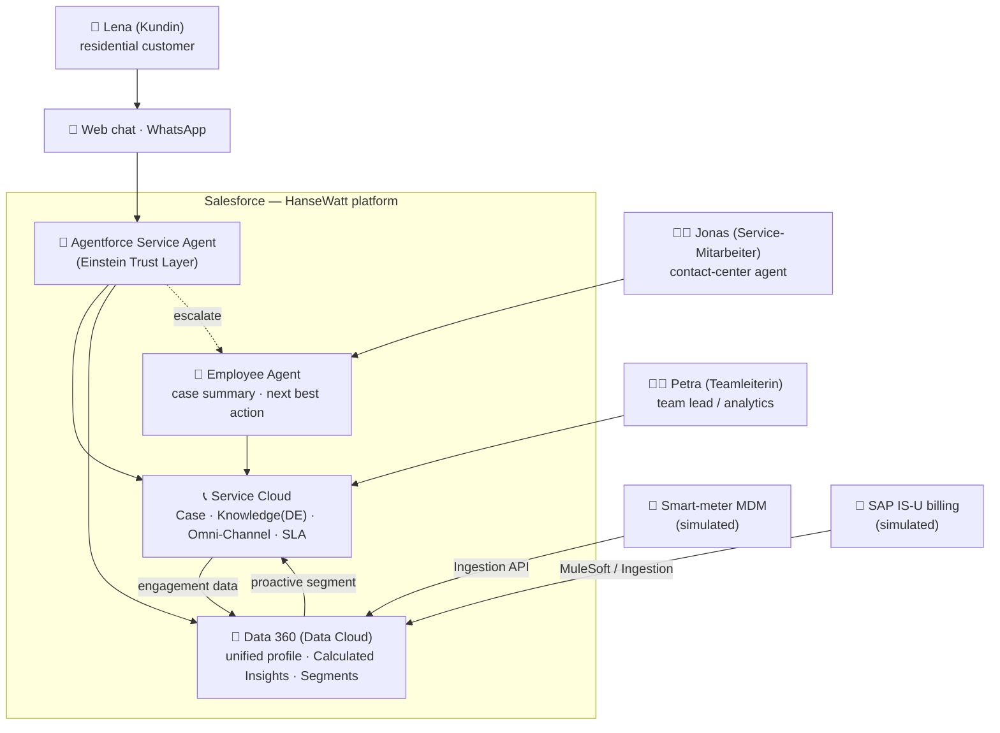

# 01 — Context Diagram

Who talks to HanseWatt and what it integrates with. Renders natively on GitHub via Mermaid.

**Reading it:** customers reach the autonomous agent via web/WhatsApp; the agent grounds on
Service Cloud (Knowledge) + Data 360 (unified profile + insights) and acts on records; it
escalates to the employee agent / Jonas; external meter + billing data flows into Data 360,
which closes the loop with proactive segments.

Next: `02-container.md` (planned) — the technical pieces inside the platform.
